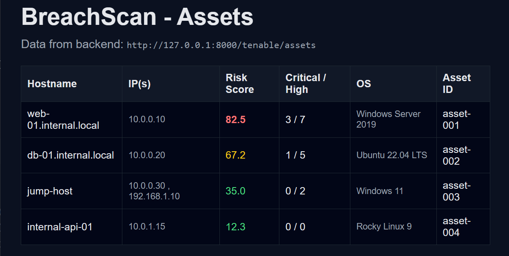
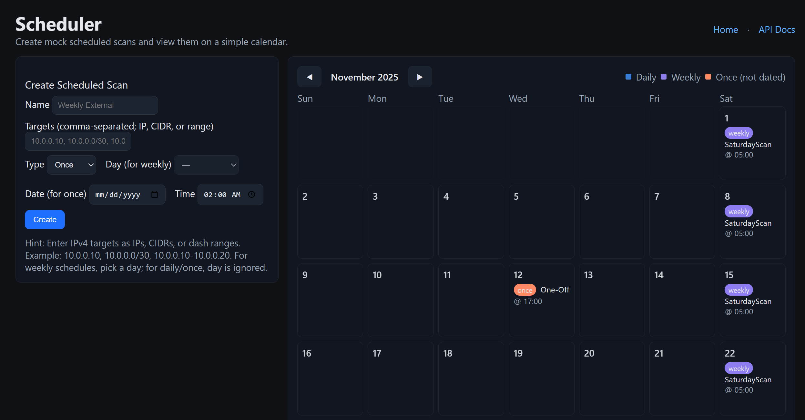
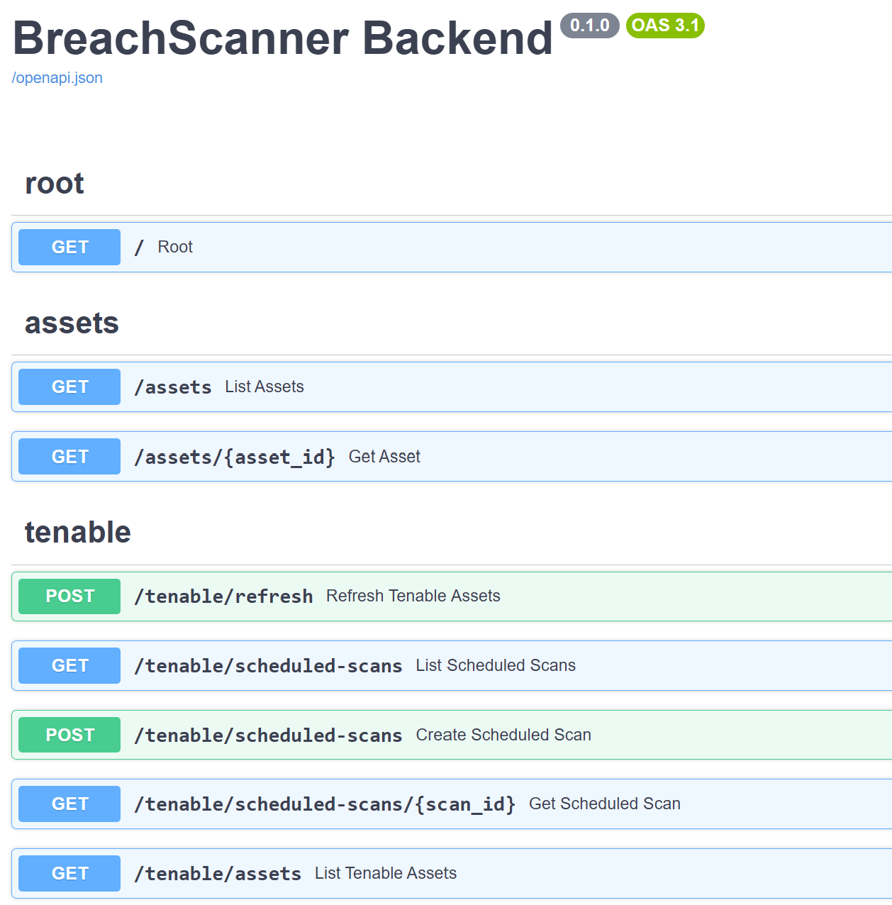

# BreachScan - Vulnerability Scan Dashboard (Prototype)
*Hands-on project built to practice Go, Python, API design, and Tenable/Nessus-style workflows.*


---

## Quickstart (TL;DR)

```powershell
git clone https://github.com/Sentinel-Zero/BreachScan.git
cd BreachScan\breachscan_backend
python -m venv .venv
.\.venv\Scripts\activate
pip install -r requirements.txt
uvicorn app.main:app --reload --host 127.0.0.1 --port 8000
# In a second shell
cd ..\breachscan_frontend_go
go run .
```

Visit: `http://127.0.0.1:8000/docs` (backend API) and `http://localhost:8080` (frontend).

---

## About This Project

BreachScan is a self-initiated lab project built after interviewing for a role involving:

- Go
- Python
- Tenable/Nessus data
- API integrations
- Scheduling & orchestration
- Vulnerability management workflows

Because I did not have access to the real Tenable API, I recreated a mock version of the entire workflow:

- Python/FastAPI backend simulating Tenable/Nessus asset data  
- Go frontend dashboard  
- Scan scheduling interface  
- Calendar-style visualization  
- Risk scoring + asset viewer  

This project demonstrates rapid learning, cross-language implementation, and the ability to build a functioning system without relying on real API access.

---

## What It Does

- ✔️ Displays mock Nessus-style assets with hostname, IPs, OS, and risk scores  
- ✔️ Allows users to schedule scans  
- ✔️ Supports `daily`, `weekly`, and `one-time` schedules  
- ✔️ Expands IP ranges, CIDR blocks, and single hosts  
- ✔️ Calculates mock next-run times  
- ✔️ Backend + frontend both work locally  
- ✔️ No external dependencies or real data required  

---

## Screenshots

### **Asset List View (Go Frontend)**  


*(Shows mock asset list with risk scoring.)*

### **Scheduler + Calendar (Combined View)**  


*(Single composite image showing the scan creation form alongside the monthly calendar visualization.)*

### **Backend API Docs (Swagger)**  


*(OpenAPI / Swagger UI exposing mock assets and scheduled scan endpoints.)*

---

## ⚙️ Tech Overview (Non-Technical)

### **Backend - Python (FastAPI)**  
- Mock Tenable/Nessus-style API  
- Asset ingestion + caching  
- Target expansion + validation  
- Scan scheduling (in-memory)  
- Swagger docs at `/docs`  

### **Frontend - Go**  
- Lightweight HTTP server  
- Two pages:
  - Asset list  
  - Scheduler  
- Dark UI theme matching backend  
- Fetches real-time data from Python backend  

### **Why Python + Go?**  
To mirror the toolset used by the interviewing team and demonstrate fluency across both languages.

---

## 📁 Project Structure

```
BreachScan/
  breachscan_backend/
    app/
      main.py
      config.py
      sample_assets.json
      tenable_client.py
      routes/
        assets.py
        root.py
        tenable.py
      static/
        index.html
        schedule.html
        scheduler.html
    requirements.txt

  breachscan_frontend_go/
    go.mod
    main.go
    templates/
      index.html
      scheduler.html

  README.md
  .env.example
  .gitignore
```

---

## Running the Project

### **Backend (FastAPI / Python)**

```powershell
cd breachscan_backend
python -m venv .venv
.\.venv\Scripts\activate
pip install -r requirements.txt
uvicorn app.main:app --reload
```

### **Frontend (Go)**

```powershell
cd breachscan_frontend_go
go run .
```

### **Access the UIs**

- Go Dashboard → http://localhost:8080  
- Go Scheduler → http://localhost:8080/scheduler  
- Backend Swagger → http://127.0.0.1:8000/docs  
- Backend Scheduler UI → http://127.0.0.1:8000/static/scheduler.html

---

## API Endpoints (Summary)

Base: `http://127.0.0.1:8000`

Assets:
- `GET /assets` – file-backed mock asset list
- `GET /assets/{id}` – single asset lookup
- `POST /tenable/refresh` – load assets into in-memory cache (supports `{ "limit": n, "dry_run": true }`)
- `GET /tenable/assets` – cached asset list (auto-populated at startup)
- `GET /tenable/assets/{id}` – single cached asset

Scheduled Scans (mock):
- `POST /tenable/scheduled-scans` – create scan (body includes `name`, `targets`, `schedule`)
- `GET /tenable/scheduled-scans` – list all (`{"scans": [...]}`)
- `GET /tenable/scheduled-scans/{scan_id}` – fetch one

Schedule body variants:
```json
{"type":"once","date":"2025-12-01","time":"02:00"}
{"type":"daily","time":"03:30"}
{"type":"weekly","day":"Sunday","time":"01:15"}
```

Target token formats (expanded server-side):
- Single IPv4: `10.0.0.10`
- CIDR: `10.0.0.0/30`
- Range: `10.0.0.10-10.0.0.20`

Example create (PowerShell):
```powershell
Invoke-RestMethod -Uri "http://127.0.0.1:8000/tenable/scheduled-scans" -Method Post -ContentType 'application/json' -Body '{
  "name":"Weekly External",
  "targets":["10.0.0.0/30","10.0.0.10-10.0.0.12"],
  "schedule":{"type":"weekly","day":"Sunday","time":"02:00"}
}'
```

---

## Environment Variables

Defined in `.env` (see `.env.example`) and loaded via `pydantic-settings`:

| Variable | Purpose |
|----------|---------|
| `APP_HOST` | Host bind for uvicorn |
| `APP_PORT` | Port bind for uvicorn |
| `LOG_LEVEL` | FastAPI/Uvicorn log level |
| `SCHEDULE_EXPANSION_LIMIT` | Max expanded target IPs per scheduled scan |
| `TENABLE_ACCESS_KEY` | Placeholder for future real API key |
| `TENABLE_SECRET_KEY` | Placeholder for future secret |
| `TENABLE_BASE_URL` | Base URL when real ingestion added |

Restart backend after changes.

---

## Scheduler Details

Metadata stored per scan:
- `expanded_target_count` – after IP/CIDR/range expansion
- `next_run_at` – naive UTC timestamp of next occurrence (or null if past once schedule)
- `created_at` – creation timestamp
- `enabled` – always true initially (future toggle endpoint)

Expansion rules use Python's `ipaddress` and enforce the limit set by `SCHEDULE_EXPANSION_LIMIT` to prevent runaway memory usage in mock mode.

---

## Roadmap (Technical)

- Persistence (SQLite/Postgres) for assets & scans
- Enable/disable + delete scan endpoints (PATCH/DELETE)
- Auth (JWT or API key) and RBAC
- Tagging & filtering of assets (risk thresholds, OS families)
- Real Tenable ingestion via `pyTenable` (pagination + normalization)
- Timezone-aware scheduling & cron-like advanced expressions
- Export/reporting (CSV, JSON bundle)
- Metrics endpoint (`/metrics` for Prometheus)

---

## Testing Ideas (Future)

- Unit tests for target expansion edge cases (large CIDRs, reversed ranges)
- Schedule boundary tests (midnight rollover, weekly day wrap)
- Data shape validation when real Tenable ingestion added

---

## ⚠️ Disclaimer

All data and scheduling logic are mock/prototype quality - not production hardened. Replace sample assets and in-memory stores before serious use.

---

## 📬 Contact

**Brian D’Hurieux**  
Cybersecurity Engineer / Software Developer  
GitHub: https://github.com/Sentinel-Zero


---

## 💡 Why I Built This

To demonstrate:

- Fast adoption of unfamiliar technologies  
- Ability to recreate the team's workflow without real API access  
- Experience with backend + frontend design  
- Experience modeling vulnerability + scheduling workflows  
- End-to-end system building across Go and Python  

This project reflects how I solve engineering problems:

> **“If I don’t have access to the environment, I build a mock version and keep moving.”**

---

## 📬 Contact

**Brian D’Hurieux**  
Cybersecurity Engineer / Software Developer  
- 📧 Email: brian.s.dhurieux@gmail.com
- 🌐 Website: https://briangineering.com  
- 🐙 GitHub: https://github.com/Sentinel-Zero